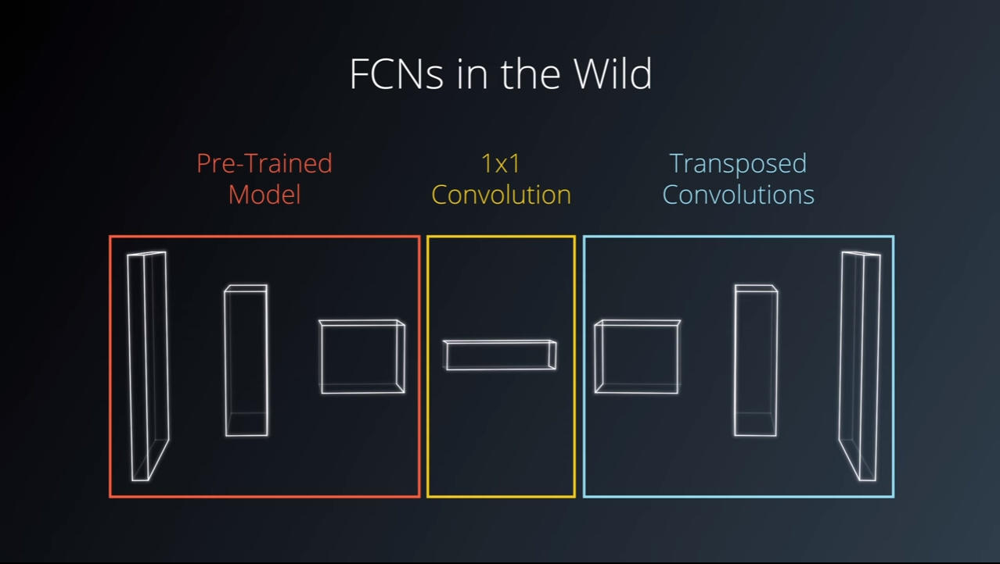

# semantic-segmentation
Semantic Segmentation for self driving cars for 2 classes Road and not Roa

## Introduction
A Fully Convolutional Network (FCN) is used to label the pixels of a road in images.

## Dataset
Download the [Kitti Road dataset](http://www.cvlibs.net/datasets/kitti/eval_road.php) from [here](http://www.cvlibs.net/download.php?file=data_road.zip).   
Extract the dataset in the `data` folder.  This will create the folder `data_road` with all the training a test images.

## Fully Convolutional Networks (FCN)
An FCN was used in this project because it retains the spatial information during training. This can be really helpful when trying to identify where an object is in an image. The architecture used in this project is divided into three main parts as shown in the architecture below:
* 1- Encoder: Pre-trained VGG16 neural network
* 2- 1 x 1 convolution
* 3- Decoder: Transposed convolutions and skip connections

## Hyper-parameters
The following Hyper-parameters were used in training the FCN

| Parameter                        | Value   | 
|:--------------------------------:|:-------:| 
| Keep Probability                 | 0.75    | 
| Batch Size                       | 8       |
| Epochs                           | 5       |
| Learning Rate                    | 0.0001  |
| Normalization Standard Deviation | 0.01    |

## Setup
#### Frameworks and Packages
Make sure you have the following is installed:
 - [Python 3](https://www.python.org/)
 - [TensorFlow](https://www.tensorflow.org/)
 - [NumPy](http://www.numpy.org/)
 - [SciPy](https://www.scipy.org/)
